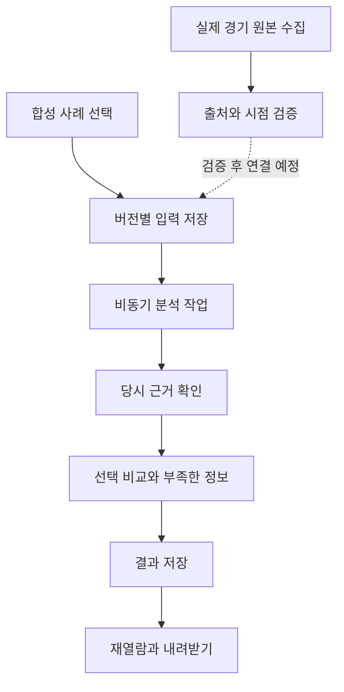

# R4 — 로컬 합성 복기 워크벤치

2026-10-04. 위험 DEEP. Design v1.0 동결 파일, 원본 R0 코드, R3 이력은 변경하지 않았다.
현재 기능은 개발용 SYNTHETIC_ONLY이며 실제 경기 코칭 완료를 의미하지 않는다.

## 처음 사용하는 사람을 위한 구조



웹 화면은 입력·근거·비교·저장 결과를 보여준다. Python API는 인증, 입력 검증, 작업 실행을 담당한다.
SQLite는 입력 버전과 작업 결과를 보존한다. R3 코어가 판단 자료를 처리하며 실제 게임 승률이나 행동 추천을 생성하지 않는다.

## 실행

Python 3.12+, requirements-r3.txt의 pydantic 설치 후 저장소 루트에서:

```sh
python3 -m pip install -r requirements-r3.txt
python3 -m coach_v1.server --db private/reviews.sqlite --token-file private/token --port 8765 --max-body-bytes 1000000 --max-observations 1000 --max-actions 24 --max-scenarios 16 --max-comparisons 512 --max-pending-jobs 8
```

브라우저에서 http://127.0.0.1:8765 를 열고 private/token의 접속키를 입력한다.
예시 불러오기 → 사례 저장 → 분석 실행. 저장한 사례를 선택하면 최근 완료 결과를 다시 연다.
위 수치는 명시적인 개발용 자원 제한이며 게임 판단 임계값이 아니다. 하나의 DB는 서버 한 프로세스만 사용한다.
접속키·DB·실제 수집 자료는 개인 로컬 파일로 유지한다. 웹 서버는 루프백만 수신하며 배포용 서버가 아니다.

## 구현 계약

- /dev/v1 전용 TEST/SYNTHETIC 인터페이스. PRE_GAME, POST_GAME, LIVE_STATIC 실제 실행 차단.
- 요청 Bearer 인증, Host/Origin 검증, 외부 호출 차단, CSP, 텍스트 기반 렌더링.
- 입력 버전 충돌 409, 같은 idempotency key/요청 재전송은 재사용, 내용 변경 시 충돌.
- 입력 변경 후 과거 결과에 stale 표시. 결과와 당시 입력 버전 연결 유지.
- 작업 QUEUED → RUNNING → COMPLETED/FAILED/CANCELLED. 재시작 시 RUNNING은 INTERRUPTED 실패로 보존하고 QUEUED는 계속 처리.
- 취소·삭제 중 계산 완료가 도착해도 결과를 부활시키지 않는다. 삭제는 사례·입력·작업·결과 연쇄 삭제. 외부 백업·내려받은 파일은 별개다.
- Store.backup(destination)은 덮어쓰기 없는 SQLite 일관 백업. UI에는 백업 버튼이 없다.

| 경로 | 동작 |
|---|---|
| /dev/v1/status | 상태와 자원 제한 |
| /dev/v1/examples, /examples/{name} | 제공된 합성 사례 |
| /dev/v1/sessions | 목록·생성 |
| /dev/v1/sessions/{id} | 조회·삭제 |
| /dev/v1/sessions/{id}/case | 최신 입력 조회·새 버전 저장 |
| /dev/v1/sessions/{id}/reviews | 작업 목록·분석 요청 |
| /dev/v1/jobs/{id}, /jobs/{id}/cancel | 상태 조회·취소 |
| /dev/v1/reviews/{id} | 저장 결과 조회 |

## 실제 자료 수집 준비

공식 문서 https://developer.riotgames.com/docs/lol 의 Game Client API와 Root Certificate 항목을 확인했다(2026-10-04).
게임이 실행 중인 사용자 PC에서 공식 루트 인증서를 준비한 뒤 한 번만 수집할 수 있다:

```sh
python3 -m coach_v1.capture --ca riotgames.pem --output private/capture-001.json --max-bytes 2000000 --timeout-seconds 5
```

고정 로컬 HTTPS endpoint, 인증서 검증, 리다이렉트/프록시 금지, 크기 제한, 덮어쓰기 금지.
원본 바이트(base64), SHA-256, 수신 시점을 함께 기록한다. UNVERIFIED_LOCAL_CAPTURE로 보관하며 자동 업로드·실시간 코칭·종료 판정을 하지 않는다.
원본에는 플레이어 식별자가 포함될 수 있다. 실제 원본은 저장소에 커밋하지 않는다.
현재 환경에는 게임 클라이언트와 실제 표본이 없어 TLS 연결·실제 필드 의미·게임 종료·실제 코칭 정확도는 미검증이다.

## 검증과 이력

```sh
python3 scripts/verify_r4.py
node tests_r4/ui_races.cjs
# Playwright 설치 및 Chromium 실행 파일 필요
CHROMIUM_EXECUTABLE=/path/to/chromium python3 scripts/browser_r4.py
```

자동 검사: R3 42 + R4 21 = 63개, 보호 회귀 9개, 독립 UI 반례 회귀 2개.
브라우저: 접속·예시·저장·분석·재열람·다운로드·390px 넘침·삭제 확인.
최초 실패와 수정은 evidence/r4/HISTORY.md, 실행 증거는 같은 폴더에 보존한다.
Node VM 회귀는 브라우저 검증과 구분한다. 실제 게임 검증을 합성 통과 수에 포함하지 않는다.

## 완료 기준과 다음 의존성

R4 로컬 합성 vertical slice 구현·검증 완료. 실제 게임 원본·실행 PC 접근이 다음 adapter 검증의 외부 의존성이다.
데이터를 확보하면 필드 누락/시점/관점/패치/종료 근거부터 검사한 후 변환기를 구현한다.
실제 데이터 gate, 공개 배포·등록·정확도 검증은 아직 완료되지 않았다. Design 동결은 제품 출시 인증이 아니다.
