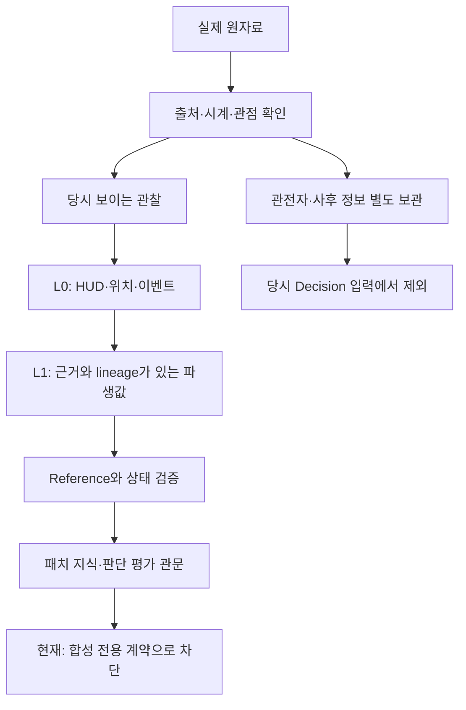

# R7 실제 근거 후속 보고

2026-10-04 KST. **공개 실제 게임 화면을 이용한 첫 observation/reference 진단을 수행했다. 전체 실제 Coaching 검증은 완료하지 않았으며 N=0이다.**

## Objective / PLAN / Authority

목표는 기능 수 확대가 아니라 SOURCE→OBSERVATION→RAW→DERIVED→DECISION→COACH 계보의 실제 근거다. 범위는 기존 R7 후속 수집·참조·offline 검증이며 R8, 대규모 Vision framework, 새로운 판단 규칙은 포함하지 않는다.

시작 실제 GitHub main HEAD: `6951f5cafbc360c4637107fe3a3fb4dc0eed0d25`. 원격165 blob와 materialized 로컬165 파일이 일치했다. 로컬은 Git checkout이 아니므로 Git working-tree 청결을 주장하지 않는다. 변경은 신규 r7-real evidence/docs/fixture/audit script와 mutable CURRENT_HANDOFF만이다. 반영 후 실제 HEAD는 GitHub fresh read로 별도 확인한다.

Risk는 evidence 작업 DEEP. 실제 엔진 진입에 Core Contract 변경이 필요한 지점은 CRITICAL/D3로 분리했다. Frozen27·기존 tests/expected·R6/R7 evidence·모드·visibility·manual lineage 불변식을 보호했다. D1/D2 재시도·수정·검증은 자율 실행했고, 실제 평가 계약 구현은 승인 전 수행하지 않았다.

독립 작업만 분리했다: 로컬 환경과 structured source 가용성 병렬 감사, locked reference 이후 blind Vision, 마지막 Core Contract 경계 read-only 검토. 동일 질문을 다수결로 검증하지 않았다. cheap verifier 순서는 fresh hash/기존 deterministic gate → 실제 source/hash/schema → reference 대조/기존 reducer → 필요한 정지 화면 Vision이었다. 사용한 pattern은 source 종류를 나눈 Multi-Modal Sweep과 마지막 Completeness Critic(독립 경계·보고 누락 검사)이다. 별도 blind Vision은 관찰 비교 목적이다. Judge Panel, 무제한 Loop, 대규모 Vision은 사용하지 않았다.

## 쉽게 보는 처리 구조

Vision은 관찰만 제출한다. 현재 manual 원천으로 계산한 health fraction도 CONDITIONAL이다. L2 전략·행동 허용·추천을 생성하지 않았다.

## R7 baseline fresh 검증

- 원격/로컬 165/165 blob 일치: `evidence/r7-real/repository-baseline.json`.
- 기존 111/111, skip0/error0/failure0; 보호9/9, Frozen27 hash PASS: `evidence/r7-real/r7-fresh/`.
- 실행 대상6951f5c와 원본 verifier의 내부 R6 parent884a435 표기를 `r7-fresh-binding.json`에서 구분했다. verifier 및 과거 증거는 변경하지 않았다.
- R6 기능·browser/mobile PASS는 이전 R7에서 fresh 수행한 **Historical evidence**다. 이번 UI/browser/mobile 회귀를 새로 수행했다고 주장하지 않는다. 관련 구현·테스트·과거 receipt가 hash 동일하여 재사용했다. 이번 YouTube browser 읽기는 R6 UI 검증이 아니다.

## 실제 Source 확보 결과

| Source | 실제 확인 | 남은 제한 |
|---|---|---|
| Work local endpoint | LoL/Riot 프로세스0, port2999 listener0, 한 번 TCP ECONNREFUSED; 공식 CA hash/context 검증 | EXTERNAL_ENVIRONMENT_BLOCKER. TLS handshake 전 실패, 권한/TLS/구현 오류를 추정하지 않음. 반복 재시도 중단 |
| Publisher Match/Timeline JSON | pinned GitHub commit에서 두 원본 취득·blob/SHA-256 확인; 23개 선택 경로 전사 일치 | matchId가 서로 달라 join 거절. exact-file Riot 원천·player visibility·timeline patch 연결 미확인 |
| 기존 YouTube 후보 | fresh DOM: readyState0, videoWidth/Height0, currentTime0; 한 play/reload 회복 후도 frame 없음 | 원인 미확정. bot/TLS 문제라고 주장하지 않음. 자막은 화면 근거 아님 |
| 공개 연구 PDF | 원본 PDF hash와 두 embedded LoL JPEG 원본 확인 | patch/match/mode 미확인, bot nameplate 관찰. 사람이 플레이한 경쟁 경기라고 확정하지 않음 |
| 원 작성자의 screenshot blog | 원본 PNG3개 실제 취득; player-style2/observer1 라벨·HUD 확인 | 2012 publication은 patch가 아님. 세 화면이 동일 경기라는 증거 없음 |

공개 출처: [연구 PDF](https://uu.diva-portal.org/smash/get/diva2:1767167/FULLTEXT01.pdf), [원 작성자 screenshot 게시물](https://ahndoori.blogspot.com/2012/10/lol-league-of-legends-screenshot.html). 원본 media와 publisher JSON은 Git에 재게시하지 않았다. URL, pinned commit/blob, 원본 hash, PDF page/image 순번, 선택 경로와 취득 receipt로 재현한다. `visual-source-manifest.json`과 `STRUCTURED_SOURCES.md` 참조. 원자료 취득은 성공했으므로 “Work에서 어떤 플레이 화면도 확보할 수 없다”는 이전 추정을 유지하지 않는다.

## Reference Dataset / 10개 슬롯

기존10 슬롯과 expected/status 원본은 보존했다. 새 overlay에서 다음3 슬롯에 **부분적인 실제 화면 기준**을 연결했다. 이것을 완전한 실제 Replay/Decision Reference3개로 계산하지 않는다.

| Reference | 장면 / game time | 직접 전사한 정보 | 상태 |
|---|---|---|---|
| REAL-VIS-01 | Garen 라인 2v1 skirmish / 06:19 | level5, HP848/1103, KDA0/0/1, CS16, 주 화면 아군 다른1·적1, 양색 minion | LANE_TRADE의 부분 기준. sequence/intent/damage window 미확인 |
| REAL-VIS-02 | Irelia–Annie mid / 01:36 | level1, HP670/670, 자원350/350, KDA0/0/0, CS0, 양색 minion | CS_ACCESS 부분 기준. 실제 last hit/trade는 미확인 |
| REAL-VIS-03 | Ryze / 17:02 | level9, HP1134/1134, 자원1339/1339, KDA0/4/4, CS51; 주 화면 적0 | JUNGLE_UNCERTAINTY 부분 기준. “주 화면 적0” ≠ 맵에 적 없음/정글 도착 불가 |
| REAL-VIS-04 | Sivir fountain / 00:13 | level1, HP460/460, 자원246/246, KDA0/0/0, CS0 | 시작 HUD 보조 기준, 대표3 유형 분모에 추가하지 않음 |
| REAL-OBS-01 | Sona 관전자 / top clock12:53 | 선택 level7·HP1050/1050; replay label12:52 별도 | 실제 no-hindsight 제외 control. 다른 player 화면의 ground truth가 아님 |

Reference 작성자는 AI operator이며 human annotator가 아니다. 최초 전사 JSON hash를 extraction 전에 고정했다. 두 AI가 같은 원본을 본 것은 독립적인 실제 정보원이 둘이라는 뜻이 아니며 source independent_group은 image hash 하나다. 원본의 게임 캡처는 확인했지만 실제 match identity/authenticity/patch/경기 방식은 독립 검증되지 않았다.

`visual-reference-initial.json`과 lock은 그대로 보존했다. observer HP/maxHP 1000 오독은 1050으로 별도 revision에 기록했다. 최초58필드 비교56일치/2불일치를 지우지 않았다. Player-style4개 화면53개 선택 필드는53개 일치했다. 수정 후 observer5/5 일치는 수정된 기준 대조이며 새 blind 정확도 측정이 아니다. 이 수치는 **AI operator 전사와 독립 AI Vision의 진단 일치도**이고 human gold 또는 실제 State extraction accuracy가 아니다.

## Structured-only / Derived / Vision / Matrix

- 두 공개 JSON에서 기존 LiveClient용17 경로는 각각 present0/missing17. 이는 다른 schema를 지원하지 않는 현재 extractor coverage gap이다. 실제 Match/Timeline 필드가 없다는 뜻 또는 구현 bug가 아니다.
- 같은 게임의 정렬된 구조화 Source가 화면4개에 없으므로 structured-only player-state accuracy/coverage ratio는 NOT_RUN/null이다. 서로 다른 matchId나 별도 블로그 화면을 결합해 점수를 만들지 않았다.
- Selective Vision: 실제 원본5개에서 **RUN**. 4 player-style HUD와1 observer를 관찰했다. minion 존재·정적 배치 관찰은 가능했지만 wave flow/category, 의미 있는 게임 거리, 지속 formation, carry role/exposure, 실제 follow-up, skill interaction, absorption, movement/dodge, trade sequence는 여전히 미해결이다. 스틸에서 good/bad/intent/tilt를 출력하지 않았다.
- Raw manual observations와 hp/maxhp L1 lineage를 기존 reducer에 전달했다. 모든 manual 사실/health fraction은 CONDITIONAL 또는 observer 제외, 적 정글은 UNKNOWN; KNOWN 승격0, L2 생성0이다. UNKNOWN_FROM_CAPTURE는 감사용 sentinel이며 확인된 patch가 아니다.
- 29변수 전체 재검토 overlay: **pending12 / Vision-required12 / inference3 / manual2 / VERIFIED_DIRECT0 / VERIFIED_DERIVED0**. Champion Position은 실제 public timeline x/y 경로가 있어 기존 Vision-required에서 pending으로 바꿨다. 이는 사후 좌표의 비영상 경로가 존재한다는 뜻이며 player-known 위치/현재 patch가 검증됐다는 뜻이 아니다. 기존 canonical matrix 파일은 보존했다.
- 9개 variable subset에 화면 관찰 근거가 생겼다(champion, level, KDA/CS, game time, HP/resource, viewport numbers, minion presence, fog/UI, visible information). 전체 의미가 해결된9개 변수라는 뜻이 아니다. Vision-only/manual agreement를 DIRECT로 승격하지 않았다.

성능 baseline: 실제 match-authenticated cohort0, human-gold0, validated coaching0이므로 state accuracy/completeness/freshness/decision resolvability/general Vision/manual/unresolved rate는 null이다. 선택한 화면에서 Vision5회·AI manual reference5개를 수행한 작업량만 기록한다. 작은 선택 표본의 비율을 실제 운영 성능으로 주장하지 않는다.

## Missing Information / 행동 조건

| 장면 | 당시 화면으로 알 수 있는 것 | 행동 결론에 필요한 미확인 정보 | 조건부 후보 / unlock |
|---|---|---|---|
| Garen skirmish | own HUD, 주 화면 가시 인원·minion | patch 적용 스킬/거리, 적 응답, wave 흐름, 정글 last-seen, 지원/복귀 경로 | THREAT/SINGLE_HIT/SHORT_TRADE 후보 각각 feasibility를 추가 확인. 정보 부족만으로 NO_ACTION 확정 안 함 |
| Irelia CS | own HUD, Annie와 minion 존재 | last-hit window/minion HP, attack range, 스킬 학습/준비, 적 응답·정글 접근 | 되돌릴 수 있는 CS 접근 후보를 당시 frame sequence와 비교. 정지 화면만으로 hit permission 없음 |
| Ryze jungle uncertainty | own HUD; 주 화면 가시 적 없음 | target/정글 role·last_seen·경로, 시야, 복귀 경로, 행동 목적 | DEEP_CHASE/ALL_IN은 조건부/미판정. 추가 player-known 정보가 결론을 가를 때만 요청 |

`assess_information`은 기존 exploratory requirement catalog를 재사용했다. 좌표/visibility/return path 등 검증된 key가 없어 permission은 NOT_EVALUATED다. 후보 명칭은 정보 요구 분석이며 실제 엔진의 추천/유효 판단으로 계산하지 않는다. Intent는 모두 UNKNOWN이다.

## No-hindsight / Coaching / 오류 계층

실제 observer observation을 동일 observer session의 PLAYER_REVIEW reducer에 넣으면 모두 NOT_PLAYER_KNOWN으로 제외된다. 그 실제 observer를 다른 실제 player capture session에 넣으면 cross-session 거절이다. 원본의 top12:53/replay12:52는 따로 보존했다. 같은 경기 player/ground-truth pair0이므로 실제 decision quality/outcome validation PASS를 주장하지 않는다.

| 평가 단계 | 이번 결과 |
|---|---|
| State correctness | 선택된 player HUD53/53 진단 일치. 전체 State/patch/perspective 인증 미완료 |
| Knowledge applicability | NOT_RUN: patch/queue/실제 matchup 적용 근거 미확인 |
| Strategy / Decision validity | NOT_RUN: 위 관문 및 보호된 SYNTHETIC_ONLY 계약 |
| Execution advice | NOT_RUN: 동작 sequence와 정답 advice 미확인 |
| Coach fidelity | NOT_RUN: 실제 Coach 출력0 |
| Outcome | 미취득·판단 입력에서 제외 |

발견된 오류: EXTRACTION_ERROR 1건/2필드(operator observer HP 전사), STATE_ERROR 예방 control(matchId mismatch 및 observer cross-session join 거절). State pipeline의 실제 오판이 발생한 것으로 집계하지 않았다. KNOWLEDGE/STRATEGY/DECISION/EXECUTION/COACH 오류율은 평가하지 않았다. 해당 단계는 EVIDENCE_GAP과 계약 blocker이며 FAIL rate0으로 보고하지 않는다.

## Fixtures / 실패 이력 / 검증

새 fixture는 screenshot reference의 **EXPLORATORY** 파일 하나(5개 기록)이며 Golden 승격0, 기존 fixture 수정0이다. 실제 gameplay counterfactual은 NOT_ESTABLISHED. 실제 자료의 observer/cross-session negative control은 data routing 검증이지 게임 선택의 반사실 정답이 아니다.

실패 이력: Web PDF screenshot 오류 → 원본 PDF 다운로드/embedded bytes 추출로 REPAIR; bs4 미설치 → stdlib HTMLParser; 최초 reference 저장 경로 오류 → 올바른 repo 경로 생성; 신규 audit의 provenance key와 snapshot key 표기 불일치 두 번 → 기존 schema에 맞춰 REPAIR/RETEST; observer 전사 오류 → 최초 lock 유지/별도 revision. YouTube frame 없음과 local structural blocker는 추정 원인으로 덮거나 반복 retry하지 않았다. `audit-history.json`, `HISTORY.md`에 보존한다.

검증: fresh111/111 + 보호9/9 + Frozen27; baseline old164(임시 handoff 제외) blob 보존; JSON/static refs; 새 audit py_compile; actual media5 hash; reference lock; schema REAL 거절5; manual/derived non-promotion; unknown 적 정글 유지; observer 제외와 cross-session 거절. 원본 R7 verifier의 실패·과거 PASS 기록을 덮지 않았다. 신규 audit 최종 입력 hash/실행 receipt는 `AUDIT_INDEX.json`에서 찾는다.

## 완료 판정 / D3 / 다음 단계

- 첫 실제 공개 화면 observation/reference 및 selective Vision을 얻어 synthetic-only 원자료 상태에서 진전했다.
- A(완전한3 actual Reference + 실제 State/Decision 평가)는 **미충족**이다. 세 슬롯은 부분 기준이며 Coaching N0이다.
- B(Work에서 실제 플레이 화면 획득 불가)는 **해당하지 않는다**. 공개 원본 화면 확보에 성공했다. local endpoint만 structural External Blocker다. 이를 전체 자료 획득 불가로 확대하지 않는다.
- 대신 실제 기존 Engine까지 진행하려는 지점에서 명확한 **D3/Core Contract boundary**에 도달했다. Frozen27 변경0, 기존 core guard 변경0이다. 구체안은 `C3_REAL_AUDIT_PROPOSAL.md`. 승인만으로 데이터·지식 gap이 사라지지는 않는다.
- 다음 자동 우선순위: 같은 경기/patch/player clock의 검증된 HUD/구조화 값(높은 impact·저비용) → 필요한 last-seen/event/position derived 정보 → selected clip의 timing/interaction → 나머지 geometry/formation. Intent·심리 추정은 후순위다.
- 승인 후 offline 실제 분류 계약·adapter·targeted regression을 먼저 구현하고, eligible Reference에서만 실제 Decision/Coach 분모를 늘린다. 자료 unlock 조건은 `MINIMUM_INPUT_PACKAGE.md`. 현재는 보호 경계 승인 요청에 필요한 작업과 결과를 먼저 구체화한 상태다.
