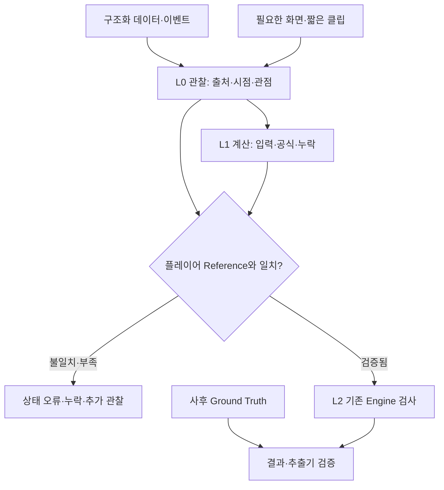

# R7 — State Source / State Accuracy 감사

2026-10-04 UTC. **자료·상태 진단 구현과 기존 R6 재검증 완료. 실제 경기 코칭 정확도는 측정 불가(N=0).**
위험 DEEP 유지. 동결 계약을 바꿀 근거는 발견하지 못했고 D3 변경을 실행하지 않았다.

## 목표·범위·권한

- Objective: 실제 판단에 필요한 정보의 출처·가용성·상태 변환·검증 경계를 증거로 구분한다.
- Scope: 기존 R6 fresh verification, 29개 변수/8개 source record, 원시 추출 진단, 정보 요구량, 10유형 replay 검토 슬롯, no-hindsight 반례, baseline.
- Acceptance: 아래 16개 항목의 완료/부분/차단 상태를 각각 기록한다. 자료가 없는 항목은 성공으로 합산하지 않는다.
- Constraints: Frozen/R0~R6 코드·기존 기대값·과거 evidence 보존. 수치 TTL·신뢰도 목표·코칭 정확도 목표를 임의 설정하지 않는다.
- Evidence: GitHub main/tree/blob fresh-read, 원본 hash, 공식 문서, 기존 deterministic suite, 새 반례, 브라우저 결과. agent 수는 근거의 강도가 아니다.
- Dependencies: 실제 플레이어 화면 또는 실제 수집 JSON, 경기 시계·patch·관점 연결, 독립 Reference State, 기존 엔진의 SYNTHETIC_ONLY 한계.
- Authority: D1/D2 구현/재시도/검증 자율 진행. 보호 계약 변경은 별도 D3/C3 proposal이 필요한 경우에만 분리한다.

## 처음 보는 사람을 위한 구조



영상은 관찰을 보완한다. 판단 전에 당시 알 수 있었던 상태를 확인한다. 사후 진실은 당시 입력에 합치지 않는다.
현재 구현에서 실제 자료는 L0/L1 **진단**까지이며, L2 기존 엔진 연결은 합성 반례로만 확인했다. 실제 경기 입력을 SYNTHETIC으로 이름만 바꾸어 통과시키지 않는다.

## 실제 repository와 R6 fresh 검증

기준 branch `main`, HEAD `884a435e52fa20e21971269dd52e30239fc4f8ff`, tree `63fe8809d3f4a37031e492196ecea41f4853ad95`.
원격 124개 blob과 작업 파일 124개가 시작 시 일치했다. 작업 폴더는 `.git` 없는 materialized tree이므로 Git working-tree clean/ahead-behind 상태는 주장하지 않는다.
R7 commit 후 최신 HEAD는 GitHub의 현재 main 및 commit receipt를 확인한다. 이 문서의 위 SHA는 재검증 대상 R6 기준점이다.

| 항목 | Fresh 결과 | 정확한 범위 |
|---|---|---|
| 기존 R3~R6 자동 검사 | 96/96 PASS | 2026-10-04T11:01:47Z; skipped 0 |
| 보호 회귀 | 9/9 PASS | 재구성 동결/계보 검사. 과거 R1 32/32 재현 의미 아님 |
| 합성 분석·자료 진단 | PASS | 기존 경로 실행; 실제 경기 판단 아님 |
| 영상 후보·주제 필터 | PASS | 33개 색인, WAVE 9개. 시각적 사건 검출 아님 |
| 후보 당시 근거/의도/대안/사후 노트 | PASS | 4개 사용자 문자열 저장. R6에는 구조화된 Intent confidence/scenario 검증이 없음 |
| Version | PASS | immutable revision + CAS 충돌 차단; 과거 버전 선택/복원 UI 없음 |
| 재열람·Download·Delete | PASS | 새로고침 후 최신 노트, 비코칭 export, 자료+노트 연쇄 삭제 |
| Browser / Mobile | PASS | 데스크톱 및 390px 모바일 overflow, page errors 0. 모바일 실기기 검증 아님 |
| UI race / file race | PASS | 이전 검증기 실행 |
| Workflows | tracked workflow 없음 | 트리의 `.github/workflows` 없음. workflow API 조회는 connector 허용 endpoint 제한(400); 원격 CI PASS 주장 없음 |

Fresh 증거는 `evidence/r7/r6-fresh/`, 시작 tree/해시는 `evidence/r7/repository-baseline.json`, `baseline-tree.json`.
`evidence/r3`~`r6`의 기존 PASS는 Historical로 보존하며 재현된 범위만 Fresh로 기록했다.
원본/설계: `legacy/backend`, `docs/DESIGN.md`, `FREEZE_MANIFEST.json`. 기존 fixture/기대값은 `examples/r3`, `contracts/scenarios.json`, `tests_r3/helpers.py`, `validation` 및 R3~R6 tests에 있다.

최종 R7 통합 검사: **111/111(기존96+신규15), 보호9/9 PASS**, skipped0. `evidence/r7/20261004T111536178607Z/verification.json`과 `HISTORY.md`에 원본 해시·초기 누락·수정·재검증 이력이 있다. 독립 수정 확인은 반례2/2 PASS다.

## Source Matrix와 가용성

상세 29행: [STATE_SOURCE_MATRIX.md](STATE_SOURCE_MATRIX.md), 기계 판독용 `contracts/r7/state_source_matrix.json`.
상세 출처: [DATA_AVAILABILITY_AUDIT.md](DATA_AVAILABILITY_AUDIT.md), `contracts/r7/sources.json`.

| 현재 자료에서의 경로 상태 | 변수 수 |
|---|---:|
| UNKNOWN_PENDING_VERIFICATION | 11 |
| VISION_REQUIRED | 13 |
| INFERENCE_ONLY | 3 |
| MANUAL_ONLY | 2 |
| VERIFIED_DIRECT / VERIFIED_DERIVED | 0 / 0 |

이는 **실경기 가용성** 분류다. 문서 예제의 필드 존재 자체를 미확인으로 숨기지 않고 출처 감사에 별도로 기록했다. VISION_REQUIRED 13은 현재 자료에 대한 분류이며 실경기 Vision 사용률도, 미래 API로 해결 불가능하다는 주장도 아니다.

- Structured: 공식 보존 예제에서 선택한 17개 경로의 값/누락 상태를 추출. 챔피언, 레벨, KDA/CS, 룬 ID, 소환사 주문 이름, 자원 등. `allPlayers[0]`를 activePlayer와 임의 identity join하지 않는다. 현재 아이템/스킬 상세 전체를 새 추출기로 구현했다는 주장은 없다.
- Event: 기존 진단기의 이벤트 수·ID·시간 검사를 재사용. 샘플의 GameStart만 관찰했으며 타워/오브젝트 전체 사건 이력을 검증한 것이 아니다.
- Derived: health/maxHealth 비율만 공식과 lineage를 붙여 진단. 샘플 maxHealth=0이므로 UNKNOWN. 이동 가능성·궁극기 준비·웨이브 우위를 만들어내지 않는다.
- Selective Vision: geometry/spacing/formation/interaction 등 화면이 필요한 슬롯을 지정. 검증 가능한 프레임 0개이므로 실제 Vision 적용 NOT_RUN.
- Knowledge/Intent: patch가 맞는 지식과 관측 근거 필요. 의도는 별도 hypothesis+confidence+대안으로 관리하며 값이 없으면 빈 가설/UNKNOWN. R6 문자열 의도를 자동 승격하지 않는다.

## 정보 요구량과 오류 분리

`contracts/r7/action_requirements.json`은 **EXPLORATORY 진단 프로파일**이다. THREAT→SINGLE_HIT→SHORT_TRADE→EXTENDED_TRADE→ALL_IN→DEEP_CHASE의 필요 정보가 증가한다. 보편적인 새 게임 규칙/임계값은 아니다.
DEEP_CHASE는 기존 CHASE에 깊은 개입 맥락을 붙인 감사 이름이며 코어 enum을 수정하지 않았다.
부족한 항목·unlock condition·정보가 충족된 낮은 개입 후보를 반환한다. 후보의 feasibility, exit/abort/return 근거는 별도로 검증해야 하며 정보 충족만으로 행동을 허용하지 않는다.

Source ladder는 구조화→이벤트→결정론 계산→지식 추론→정지화면→짧은 클립→수동 태그다. 더 싼 충분한 검증 근거가 있으면 Vision 호출을 생략한다. 미시도·가용한 저비용 경로부터 확인하고 실패/불충분을 기록한다. 호출 scheduling 프레임워크는 만들지 않았다.

오류 분류: STATE_ERROR / KNOWLEDGE_ERROR / STRATEGY_ERROR / DECISION_ERROR / EXECUTION_ERROR / COACH_ERROR / EXTRACTION_ERROR / EVIDENCE_GAP.
Raw 파싱·필드 매핑 불일치는 EXTRACTION_ERROR 후보, 유효한 원천 이후 시점·관점·lineage·상태 변환 불일치는 STATE_ERROR 후보로 조사한다. 단순 비교 결과만으로 원인을 단정하지 않는다.
평가 순서: State→Knowledge→Strategy→Decision→Execution→Coach→Outcome. 이전 단계가 실패/미확인이면 뒤 단계의 품질 주장을 보류한다. Outcome은 Decision 판정 입력으로 사용하지 않는다.

## Replay / Reference / Accuracy

`fixtures/r7/representative_set.json`에 요청한 10유형을 모두 등록했다. 6개 슬롯에 R6 자막 주제 seed가 있고 **서로 다른 seed는 4개**다. 같은 seed를 재사용한 슬롯은 독립 사례 수를 늘리지 않는다. 4개 슬롯은 NOT_LOCATED다.
주제 seed는 실제 lane trade/CS 접근/false roam/jungle attraction 사건 확인이 아니다. 특히 의도적인 bait나 상대 반응을 자막 키워드로 확정하지 않는다.

모든 PLAYER_INFORMATION_STATE와 GROUND_TRUTH_STATE reference는 NOT_ESTABLISHED다. 빈 reference 양식을 생성한 것을 Reference State 완료로 계산하지 않는다. 원본 화면·시계·관점이 없으므로 Counterfactual도 NOT_EVALUABLE이고 Golden 후보는 0개다.

| 측정 | Baseline |
|---|---|
| 문서 예제 파서 agreement | 선택한 값+누락 라벨 17/17 일치; 실경기 정확도 아님 |
| 문서 예제 선택 필드 존재 | 16/17 PRESENT, 역할 라벨 1개 EMPTY |
| 문서 예제 health fraction | 미해결 1/1: maxHealth=0 |
| 검증된 Replay / Reference / Vision frames | 0 / 0 / 0 |
| 실제 State accuracy·completeness·freshness | N=0, null / NOT_RUN |
| 실제 Decision resolvability·Vision-required·manual-intervention·unresolved rate | N=0, null / NOT_RUN |
| 실제 Coaching accuracy | N=0, null / NOT_RUN |

분모 0은 0%나 100%가 아니다. 10개의 검토 슬롯도 검증 사례 분모가 아니다. 문서 예제와 합성 테스트는 대체 검증의 범위를 명시한다.

No-hindsight: 관전자/미래 observation을 추가해도 당시 engine evaluation/alternatives가 변하지 않는 합성 반례 통과. Ground Truth만 있는 경우 player reference로 대체하지 못한다. 실제 Replay no-hindsight는 reference가 없어 NOT_RUN.

## 실패·수정 이력과 남은 차단

1. 원격 workflow endpoint 조회 제한: REPLAN. tracked tree로 workflow 파일 유무를 확인했고 CI 실행 여부는 주장하지 않음.
2. 출처 감사 초안이 공식 문서의 `position=MIDDLE`을 보존 sample 값으로 혼동: REPAIR. raw/hash 직접 재확인 후 sample은 빈 문자열로 정정; 예제 reference 검사에 고정했다. Frozen fixture 변경 없음.
3. 초기 Matrix L2 정의가 의미/의도와 전략 판단을 혼동: REPAIR. L2를 action permission/damage window/forced loss/recovery로 정합화; Intent는 별도 가설 공간. 코어 변경 없음.
4. R7 local 재수집의 인증서 다운로드가 timeout: RETRY. 과거 공식 인증서 파일의 SHA256·TLS context를 확인해 재사용. TLS를 끄지 않고 loopback만 연결했으나 Connection refused. 각 시도 status를 별도 보존.
5. 독립 Challenger가 참조 자기선언의 분모 승격과 Python `True == 1` 비교 오류를 재현: REPAIR. 선언 참조의 값 비교는 diagnostic으로 분리하고 실제 분모는 provenance 검증 미구현으로 0 유지. JSON 형식 인식 비교와 반례 추가. 최초 발견을 지우지 않음.
6. R5 영상 재생 00:00/미디어 다운로드 timeout은 Historical. 같은 실패 경로를 근거 없이 반복하지 않음. R7에서 영상 frame fresh PASS는 없음.

이 환경의 loopback은 사용자의 LoL 실행 PC가 아니다. 별도 결제·권한 확장이 이 사실을 해결한다는 증거는 없다.
가능한 입력은 기존 `scripts/collect_local.py`의 게임 PC 수집물 또는 시점/관점 확인 가능한 player POV 클립이다. 받은 뒤 검토 프로토콜에 따라 진행할 수 있으나 현재 자동 수신/백그라운드 대기는 설정하지 않았다.

## Acceptance 판정

| # | 항목 | 상태 / 근거 |
|---|---|---|
| 1 | 884a435 fresh verification | DONE — remote tree/blob 124/124 |
| 2 | R6 기능/회귀 | DONE — 96/96 + 9/9 + browser/mobile |
| 3 | 변수 Inventory | DONE — 29개 |
| 4 | Source Matrix | DONE — 필수 필드/상태/출처 연결 |
| 5 | Data Availability Audit | DONE — 공식 문서와 실제 확보 범위 구분 |
| 6 | L0/L1/L2 경계 | DONE(구현/합성 검증) — 실제 승격 차단 |
| 7 | 대표 Replay Set | PARTIAL — 10유형 슬롯/6 seed slots; 검증 사례0 |
| 8 | Reference State | BLOCKED — 실제 프레임/관점/시계 없음 |
| 9 | Structured-only 측정 | PARTIAL — 문서 표본17경로; 실경기N0 |
| 10 | Missing Information 분류 | DONE — 상태·원인·unlock; 실제 사례 원인확정은 보류 |
| 11 | Selective Vision | BLOCKED — 필요 관찰 지정, 입력 프레임0 |
| 12 | Extraction/Decision 오류 분리 | DONE(프로토콜/반례) — 실제 오류율 미측정 |
| 13 | No-hindsight | PARTIAL — 결정론 반례 PASS; 실제 replay NOT_RUN |
| 14 | 초기 코칭 accuracy/evidence 보고 | DONE(보고) — 정확도 자체는 BLOCKED/N0 |
| 15 | Freeze 변경 필요 판정 | DONE — 현재 증거로 변경 불필요, 유지 |
| 16 | 자동화 우선순위 | DONE — 아래 순서 |

## 다음 자동화 순서

1. High impact/low cost: 실제 JSON 확보 후 patch·identity·시계·관점 provenance와 missingness 검증. 레벨/아이템/자원/사건을 먼저 대조.
2. High impact/medium cost: 검증된 시각·위치·map/rule 입력이 있을 때만 reachability, readiness, return path 계산을 증거와 함께 연결.
3. High impact/high cost: structured+event로 미해결이며 판단을 바꿀 geometry/spacing/trade-sequence만 선택적 화면/클립 분석.
4. Low-confidence/high-cost: Intent·심리·의도적인 미끼 추정은 수동/가설 유지. 후순위.

자료가 확보되면 Reference→pipeline state 비교→오류 분류→수정/재검증→지식 적용성 검토 순서로 진행한다. 실제 평가 mode/core 계약 변경이 필요해지는 시점에는 별도 D3/C3 proposal을 만든다. 지금 합성 제한을 해제하지 않았다.

## 재현

```sh
python3 scripts/verify_r7.py
python3 -m coach_audit path/to/raw.json --out private/r7-diagnostic-new.json --max-bytes 2000000
```

진단은 신규 파일에만 기록한다. 원본 경기 JSON은 private에 보관하고 공개 repository에 올리지 않는다.
R7 verifier는 Mandatory frozen/hash gates→static references→targeted+affected regression을 실행하며 run별 evidence를 새 폴더에 저장한다. R6 UI 파일은 전부 baseline 동일하므로 fresh R6 browser 결과를 재사용한다.
Dynamic Pattern: No-hindsight adversarial 반례, Source/State 두 관점의 비중복 독립 조사, 최종 completeness 점검. Judge panel/전체 Replay Vision/추가 framework 없음.
